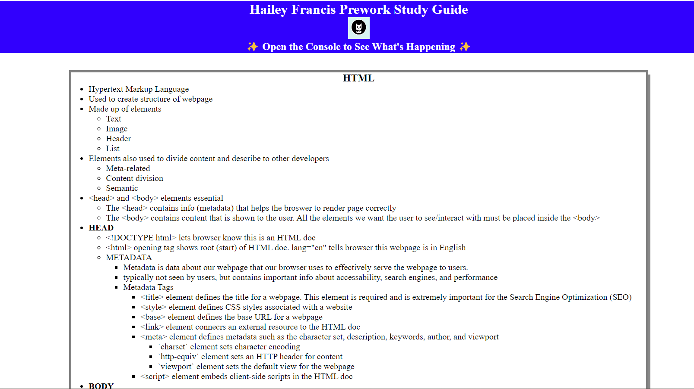
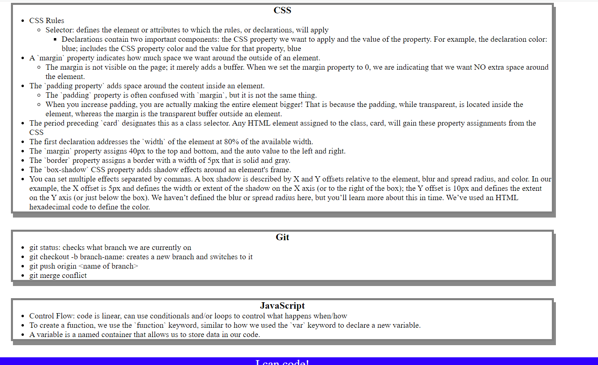

# <Your-Project-Title>

## Description

This is an online study guide for the "prework" section of the UCF Coding Bootcamp. It consists of of a singular HTML file, CSS file, and JS script, and contains notes from the lessons from the prework.

This largely served as a guide to understanding how these different files interact with one another and provide an experience to the user. It also served as a valuable exposure to proper usage of Git, in which originally I was unfamiliar with important concepts such as creating and merging branches.

I've had exposure to HTML, JS, and CSS exposure in the past, albeit briefly, in a summer Internet Programming class. This served as a welcome refresher to writing in these langauges and creating a web page. 

## Table of Contents (Optional)

While this README is short, I decided to keep the TOC so I could have a reference of a README TOC.

- [Installation](#installation)
- [Usage](#usage)
- [Credits](#credits)
- [License](#license)

## Installation

N/A

## Usage

This study guide has notes on HTML, CSS, Javascript, and Git.
It is solely meant for reading.
One can "Inspect" the page on Chrome and find the Javascript function call implementation practice outputs in the Console.

Here's the top of the page:

Here's the bottom of the page:

## Credits

This was an individual project, however the templetes, images, and guidance were provided by UCF's Coding Bootcamp.

## License

Please refer to the LICENCE in the repo.
